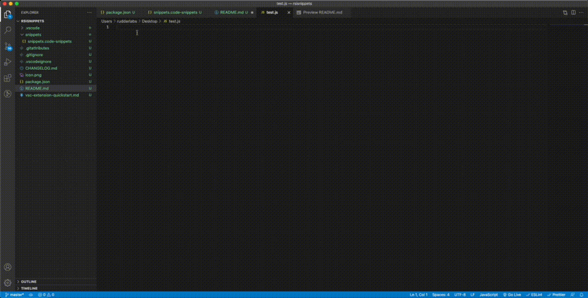
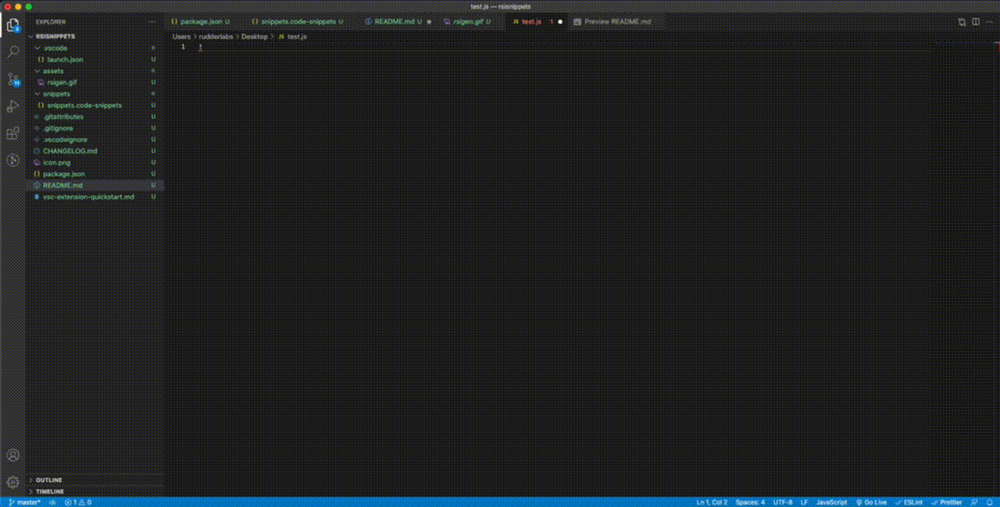
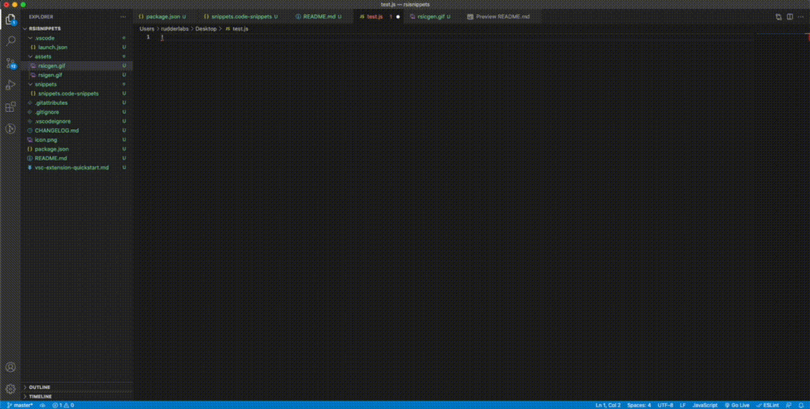

# rsisnippets README

A simple plugin  to generate Rudderstack Integration boilerplate code snippets for developers to get started.

## Features

Generate Core Integration transformation boilerplate code using `!rsi-gen` command



Generate Integration config boilerplate code using `!rsic-gen` command



Generate Integration test biolerplate code using `!rsit-gen` command



## Installation

Unix/Linux
```
cd ~/.vscode/extensions/ 
git clone repo-link

```
Restart VS-Code, and you should see RSInSnippets Installed as VS-Code extenstion

## Requirements

VS-Code Version : ^1.52.0

